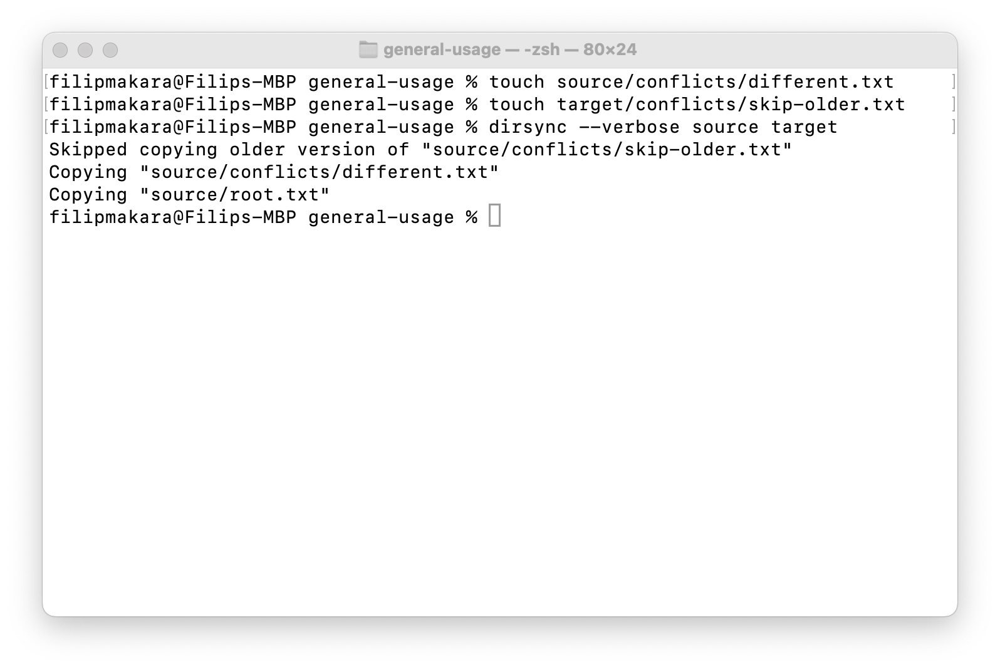

# DirSync project

[Developer documentation](./docs/Developer%20documentation.md)

[User documentation](./docs/User%20documentation.md)

Dirsync is a command-line utility for synchronizing files across directories,
either one-way from the source directory to the target one, or two-way,
synchronizing symmetrically across two source directories.
The program supports detailed control over conflict resolution, verbosity, and dry-running.
Additional directory-specific configuration is supported, saved in the directories themselves
in a local config file.


A local file can configure each directory's sync behavior,
mainly for excluding files and directories in the synchronization step.

## Examples



There is a set of examples prepared and described in the `examples` directory.
One of them is demonstrated bellow.

Make sure you update the `source/conflicts/different.txt` and `target/conflicts/skip-older.txt`
(e.g., with touch command) to be considered newer than their respective counterparts.
The initial file structure:

```
source/
| - .dirsync.json (see bellow)
| - conflicts/
|   | - different.txt (new version)
|   | - skip-older.txt (old version)
| - first/
|   | - recursive.ignored.txt
| - ignored-directory/
|   | - ignored-by-parent.txt
target/
| - conflicts/
|   | - different.txt (old version)
|   | - skip-older.txt (new version)
| - too-large-for-source.txt (more than 50 bytes in size)

source/.dirsync.json = {
  "configVersion": {...},
  "exclusionPatterns": [
    "*.ignored.txt",
    "ignored-directory"
  ],
  "maxFileSize": 50 // bytes
}
```

After syncing with the default options (one-way, override-with-newer conflict resolution)
with 

```
$ touch source/conflicts/different.txt
$ touch target/conflicts/skip-older.txt

$ dirsync --verbose source target
Skipped copying older version of "source/conflicts/skip-older.txt"
Copying "source/conflicts/different.txt"
Copying "source/root.txt"
```

the file tree will look like this:

```
target/
| - conflicts/
|   | - different.txt (new version)  !!! overriden by newer version from the source
|   | - skip-older.txt (new version) !!! not overriden, the source has older version

!!! ignored-directory is excluded, with everything inside it
!!! recursive.ignored.txt is excluded, no "first" directory is created here
```
