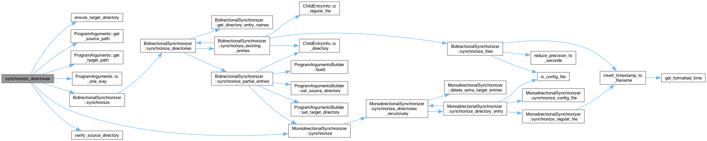
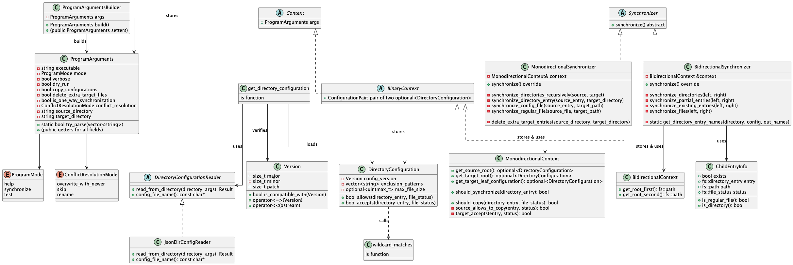

# Developer documentation: dirsync

This project implements a file directory synchronizer, capable of copying
files across directories. The program implements one-way and two-way
synchronization, with optional per-directory configuration.

The code uses Cmake for build process, located in the source root in `CMakeLists.txt` file.
Main program function parses command-line arguments and delegates other components.
Arguments are collected to a `std::vector<std::string>` and parsed to an instance
of `ProgramArguments`, defined in the `arguments.hpp` header file.

Further code structure is summarized in the table bellow:

| File                      | Description                                                                                                                                                         |
|---------------------------|---------------------------------------------------------------------------------------------------------------------------------------------------------------------|
| `arguments.hpp`           | `ProgramArguments` class, parsing, validation.                                                                                                                      |
| `synchronize.hpp`         | Entrypoint for synchronization. Creates a context for further one-way or two-way functions.                                                                         |
| `synchronize_one_way.hpp` | one-way synchronization, copying files from the source directory to the target one. Main function is `synchronize_directories_recursively`.                         |
| `synchronize_two_way.hpp` | two-way synchronization, syncing files symmetrically across two directories. Main function is `synchronize_directories_bidirectionally`.                            |
| `configuration.hpp`       | Contains `DirectoryConfiguration` class, which represents a per-directory configuration. Supplementary functions provide format-independent parsing and validation. |
| `configuration-json.hpp`  | JSON-specific serializing and parsing of `DirectoryConfiguration`.                                                                                                  |
| `wildcards.hpp`           | Exposes an utility function for matching filenames to be excluded from the synchronization.                                                                         |
| `tests.hpp` + `tests.cpp` | Provides automatic tests for various scenarios to check program correctness.                                                                                        |

In the important high-level functions, comments are written at the function signature,
further commenting the implementation details.

The following picture demonstrates the main function call graph.
High-level functions are on the left.





## Build and execution

This project is managed and configured by CMake, see the `CMakeLists.txt` file.
You can prepare, build and run the project by setting your IDE
or manually by executing these commands:

```bash
# cd to project "src" directory

# prepare CMake cache
cmake . -B build

# build project and create executables
cmake --build build

# run the executable
build/dirsync
```

## One-way synchronization

One-way synchronization is called by the `synchronize_directories_recursively` function.
It loads directory configurations, from respective files (usually `.dirsync.json`), if present.
Supplementary class `MonodirectionalContext` is provided to store such configurations in a stack.
It then uses standard `std::filesystem::directory_iterator` for getting directory entries (files and folders).
Each directory entry in the source directory tree is checked against corresponding entry
in the target directory tree and a decision is made whether and how to synchronize. If folders,
call `synchronize_directories_rescursively` recursively.

The program uses recursion rather than a state stack because it is easier to implement and understand.
Directory tree depth rarely outsizes stack memory limit.

When synchronizing files, a function `synchronize_file` is called.
Based on the command-line arguments saved in `ProgramArguments` instance,
the source file is copied to target tree, overridden with newer version or copied
to a different filename. The deciding factor is
`enum class ConflictResolutionMode { overwrite_with_newer, skip, rename }`.
When renaming strategy is used, a timestamp is appended to the original filename
in the `YYYY-MM-DD-hh-mm-ss` format. When deciding what file version is newer,
we use `std::chrono::file_clock` accuracy, but the appended timestamp is rounded
to integer seconds.
Moreover, the directory config also dictates whether the file is copied or skipped.

There is a way to delete excess files and directories in the target file tree,
using `ProgramArguments::delete_extra_target_files` flag. In that case,
a function `delete_extra_target_entries` is called on every common directory.

## Two-way synchronization

Similar to one-way synchronization, directories are synchronized recursively,
and the directory configurations (e.g. `.dirsync.json`) are saved in `BidirectionalContext`
instance in a stack.

For each common directory, a `std::set<std::string>` set of filenames is created.
Every filename is then checked against first and second source directory.
Recall that in bidirectional sync, there is no target directory, only two source ones.
Files are synchronized separately and individually. Directories recursively.

When `ConflictResolutionMode::overwrite_with_newer` is selected, the older file version
gets overridden by newer one, regardless from which source directory.

## Configurations

Application logic, the `DirectoryConfiguration` class is separated from I/O logic
by the abstract `DirectoryConfigurationReader` class.
It currently has only one descendant, the `JsonDirConfigReader` class,
but is designed to be extended for other configuration formats, e.g. TOML, XML...
When adding new implementors of the abstract reader class, create a new instance
and add it to the array of supported readers:
```cpp
const Reader *supported_readers[1] = {
	dynamic_cast<Reader *>(new JsonDirConfigReader())
	// add other readers here, e.g. new XmlDirConfigReader(), new BinaryDirConfigReader()...
};
```

The list is used by `get_directory_configuration(directory, std::optional<DirectoryConfiguration> &)`
function, where the readers are used in the order as specified, to check the existence
of config file and if so, to parse it.

For JSON manipulation, parsing and serializing, the
[JSON for Modern C++](https://github.com/nlohmann/json) library
is used as a single local header file `json.hpp`,
without the need to specially configure Cmake.
This library smoothly works with C++ standard types. 

The configuration version is also checked upon parsing. If inconsistent,
the error is written to standard error stream.

## File operations

For file operations, the `std::filesystem` functions are used. No bulk copy operations
are performed, files are copied one-by-one, individually for greater control
and file checks (file name, size).

## Automatic tests

The project contains a set of tests for various scenarios in `tests.cpp` file.
The common test class ancestor `Test` contains four important functions:
prepare, perform, assert, cleanup.

The tests can be run using `dirsync --test`.

## Unsupported features

The program does not explicitly handle hard or symbolic links or special file types
(FIFO, sockets...).

## External libraries

The sole external library, [JSON for Modern C++](https://github.com/nlohmann/json)
is used for JSON parsing of the directory configuration files (`.dirsync.json`).
The library is modern-standard-friendly.
